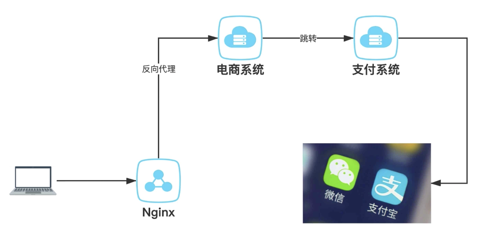
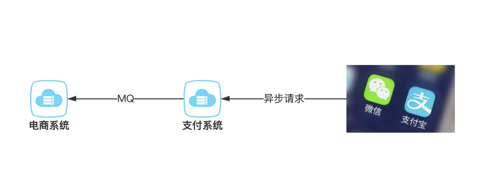

## Mall商城后端开发

### 后端系统由支付系统和商城系统组成。

使用技术架构：SpringBoot、Mybatis、RabbitMQ、Nginx、Maven。

该项目主要功能包括：``用户信息更改``、``收货地址更改``、``获取商品信息``、``购物车信息更改``、``用户下单``。

具体API可以查看项目内api文档

### 支付流程图：

下单->支付：

支付结果通知：

